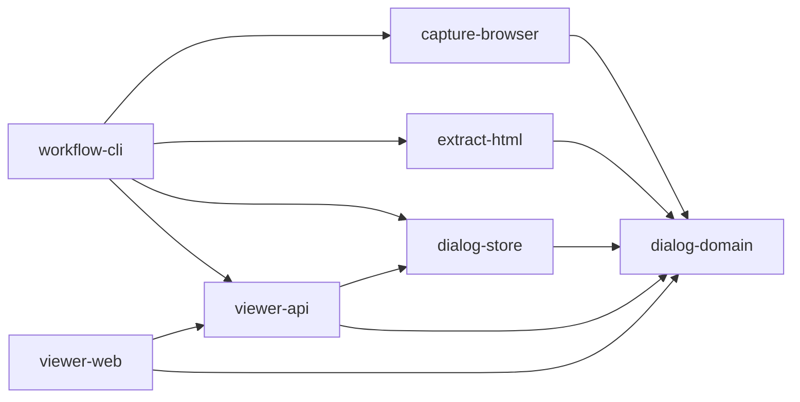

# Architecture Decision: Functional Module Breakdown

## Status

Proposed and recommended for the next rebuild.

## Context

The current repository already contains the main capabilities of the tool, but they are assembled as a small set of scripts rather than as explicit modules:

- browser capture on macOS
- HTML-to-dialog extraction
- file-system storage for captured HTML and extracted JSON
- local viewer API
- local viewer UI
- `make`-based orchestration

That is fine for proving the workflow, but not ideal for a future rebuild across new repositories.

The main architectural risk is not scale. It is boundary drift:

- browser automation mixed with workflow policy
- parsing mixed with file naming and file paths
- file storage mixed with HTTP transport
- viewer UI mixed with dialog editing rules

If this is rebuilt without strong boundaries, the next version will become another pile of scripts with better packaging.

## Decision

Break the system by stable function, not by current file, not by UI screen, and not by technology.

The future system should be rebuilt around six minimal specialized modules:

1. `dialog-domain`
2. `capture-browser`
3. `extract-html`
4. `dialog-store`
5. `viewer-api`
6. `viewer-web`

A seventh thin module, `workflow-cli`, should compose them for local use, but it should contain almost no domain logic.

## Why This Boundary Is Correct

These are the parts that change for different reasons:

- browser capture changes because browsers, permissions, and automation APIs change
- extraction changes because ChatGPT page structure changes
- storage changes because you may move from local files to another backing store
- API changes because transport and auth change
- web viewer changes because UX changes
- domain contracts should change the least

That means the module boundary should follow change pressure, not language or runtime.

## Recommended Modules

### 1. `dialog-domain`

Purpose:

- single source of truth for all core data contracts

Owns:

- dialog schema
- message schema
- capture metadata schema
- file naming policy
- title normalization
- identifiers and validation

Must not depend on:

- browser automation
- filesystem
- HTTP
- UI

Example responsibilities:

- define `Dialog`
- define `Message`
- define `CaptureResult`
- define `slugify_title(title)`

This should be the most stable module and the first one extracted.

### 2. `capture-browser`

Purpose:

- talk to the browser and bring back raw page state

Owns:

- browser selection
- browser activation/focus
- JavaScript evaluation in browser tab
- auto-scroll logic
- final page HTML capture
- capture completion notifications

Must not own:

- HTML parsing into dialog messages
- JSON storage format
- viewer logic

Inputs:

- browser selection policy
- capture timing config

Outputs:

- raw HTML
- page title
- page URL
- capture metadata

This is an adapter module. It is the most platform-specific part.

### 3. `extract-html`

Purpose:

- transform raw saved ChatGPT HTML into normalized dialog data

Owns:

- HTML parsing
- turn discovery
- message extraction
- content cleanup
- normalized dialog assembly

Must not own:

- browser automation
- HTTP routes
- UI editing

Inputs:

- HTML bytes or string

Outputs:

- `Dialog`

This should remain pure and testable.

### 4. `dialog-store`

Purpose:

- persist and retrieve raw captures and extracted dialogs

Owns:

- local file layout
- list/read/write/delete operations
- collision handling
- import directory policy
- output directory policy

Must not own:

- browser automation
- parsing rules
- UI rendering

Inputs:

- `CaptureResult`
- `Dialog`

Outputs:

- stored file paths
- file listings
- loaded dialogs

This is where local files live today, but later it could be backed by a database, S3, git, or another store.

### 5. `viewer-api`

Purpose:

- expose store operations to a client

Owns:

- HTTP transport
- route definitions
- request validation
- JSON response format

Must not own:

- browser capture
- HTML parsing
- UI behavior

Inputs:

- store interface

Outputs:

- list dialogs
- load dialog
- write dialog
- delete dialog

This module should depend on `dialog-store`, not on the browser or parser directly.

### 6. `viewer-web`

Purpose:

- provide a local UI for browsing and editing dialogs

Owns:

- sidebar
- message rendering
- collapse/expand state
- branch editor UX
- save/delete interactions

Must not own:

- filesystem access
- browser automation
- extraction rules

It should know only the API contract, not how dialogs are stored.

### 7. `workflow-cli`

Purpose:

- thin orchestration layer for local development

Owns:

- CLI commands
- `make` targets
- user-oriented local workflows

Must not own:

- parsing logic
- capture logic internals
- domain schema

Today this is mostly the `Makefile`. In the rebuild it can remain small.

## Dependency Rule

All dependencies should point inward toward stable logic.

Interpretation:

- `dialog-domain` is the center
- adapters sit around it
- orchestration sits above them
- UI talks to API, not to storage directly

## What To Extract First

Do not split everything at once.

Recommended order:

1. extract `dialog-domain`
2. extract `extract-html`
3. extract `dialog-store`
4. extract `viewer-api`
5. extract `viewer-web`
6. extract `capture-browser`
7. leave `workflow-cli` last

Why this order:

- the domain and parser are the easiest to stabilize
- store and API then become straightforward wrappers
- capture is the noisiest platform adapter, so extract it only after contracts are stable

## Suggested Future Repos

Keep the number of repos low at first.

Recommended first split:

1. `gpt-dialog-core`
   - `dialog-domain`
   - `extract-html`
   - shared tests

2. `gpt-capture-mac`
   - `capture-browser`
   - local notification adapter

3. `gpt-dialog-workbench`
   - `dialog-store`
   - `viewer-api`
   - `viewer-web`
   - `workflow-cli`

This is the minimum practical split.

Do not create six repositories immediately. That would optimize for conceptual purity at the cost of real development speed.

## Interface Contracts To Freeze Early

If you want the rebuild to succeed, freeze these interfaces before moving code:

### `Dialog`

Minimum stable fields:

- `title`
- `source_file`
- `message_count`
- `messages[]`

### `Message`

Minimum stable fields:

- `role`
- `content`
- optional `message_id`
- optional `turn_id`
- optional `source`

### `CaptureResult`

Minimum stable fields:

- `title`
- `url`
- `html`
- `captured_at`
- `browser`

### `DialogStore`

Required operations:

- `list_dialogs()`
- `read_dialog(name)`
- `write_dialog(name, dialog, overwrite)`
- `delete_dialog(name)`
- `write_capture(name, html)`

### `BrowserCapture`

Required operations:

- `select_browser()`
- `activate_browser(browser)`
- `scroll_until_stable(browser, config)`
- `capture_title(browser)`
- `capture_url(browser)`
- `capture_html(browser)`

## Current Mapping From Today’s Files

- `scripts/capture_chatgpt_tab.sh`
  - should become mostly `workflow-cli`
  - browser-specific parts should move to `capture-browser`
  - naming should move to `dialog-domain`

- `scripts/browser_eval.js`
  - belongs to `capture-browser`

- `extract_chatgpt_html.py`
  - belongs to `extract-html`
  - title normalization and slugging pieces should move to `dialog-domain`

- `viewer/server.py`
  - belongs to `viewer-api`
  - file IO should move out into `dialog-store`

- `viewer/index.html`
  - belongs to `viewer-web`

- `Makefile`
  - belongs to `workflow-cli`

## What Not To Do

Avoid these mistakes:

- do not split by script filename
- do not make browser capture and HTML extraction one module
- do not let the viewer write directly to the filesystem without a store boundary
- do not duplicate dialog schema in Python and JavaScript without a shared contract
- do not create many tiny repos before the interfaces are stable

## Practical Next Step For This Repo

If you want to prepare this repository before moving code to new repos, do this next:

1. create a small `dialog-domain` package inside this repo
2. move naming and dialog schema helpers there
3. refactor `extract_chatgpt_html.py` to consume that package
4. refactor `viewer/server.py` so file IO is behind a small store interface
5. refactor `scripts/capture_chatgpt_tab.sh` so browser selection and notification are isolated

That would give you the future repo boundaries without the operational cost of splitting repositories yet.

## Final Decision

The system should be rebuilt as a function-first architecture with:

- one stable core contract layer
- one browser capture adapter
- one pure HTML extraction module
- one storage module
- one API module
- one web UI module
- one thin workflow layer

That is the smallest breakdown that is still worth preserving across future repositories.
